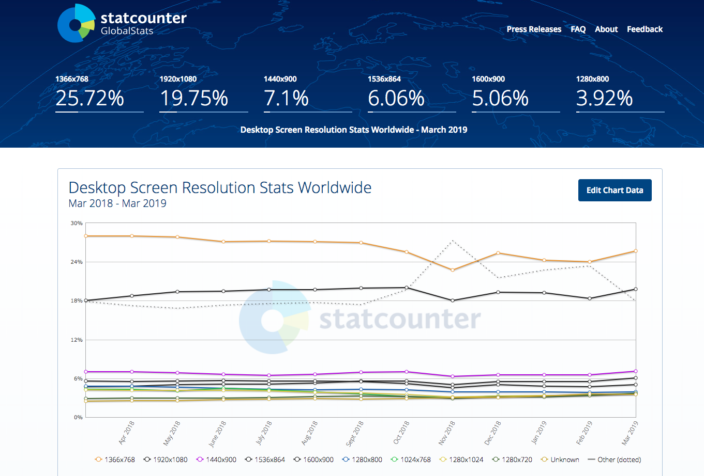
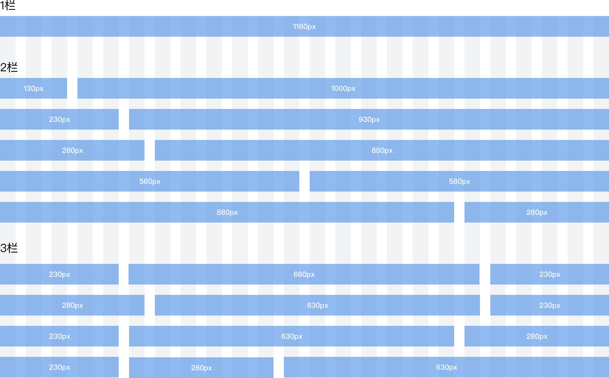
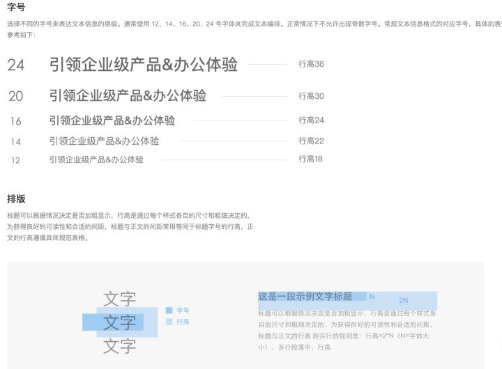
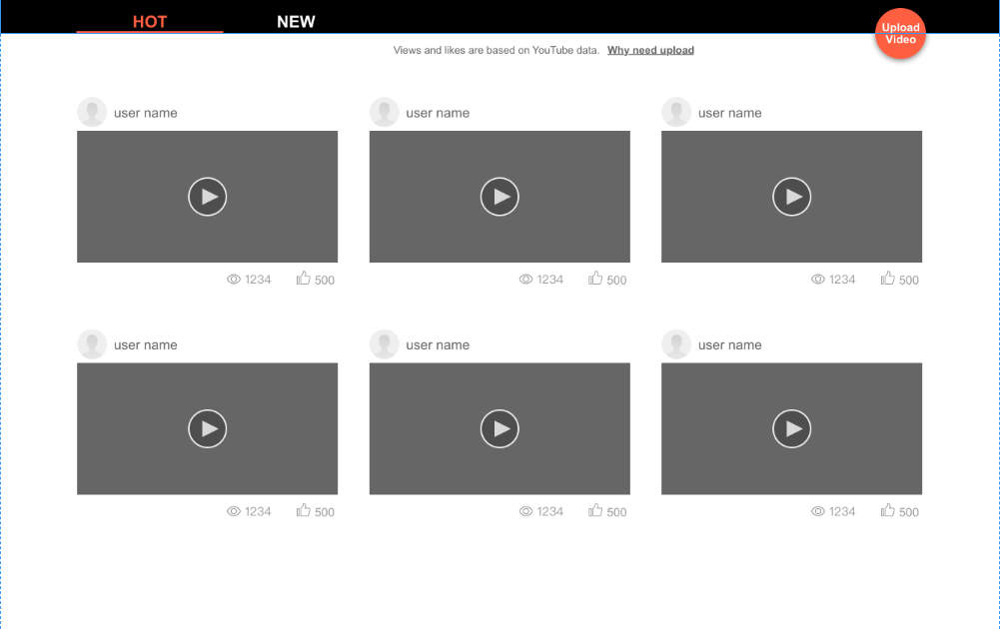
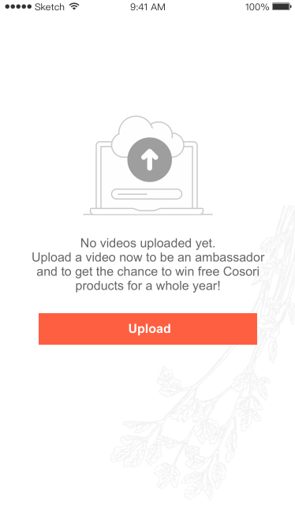

# Web前端写给Web设计师的注意事项 

> Web 设计和 Web 前端都应该仔细阅读此文档，会减少因为设计不合理导致的返工。

Web 设计因为要在浏览器中实现，有时还需要『动』起来，在设计时有一定的限制。

**前端同行应该以此文档作为审核设计稿的依据，不应该拿到设计稿直接开发。**

本文档参考自 [web-design-notes](https://github.com/onface/web-design-notes) 

---

**索引**

[资源](#hash_collect)

1. [页面尺寸](#hash_size)
	1. [最小宽度](#hash_size_min-width)
	2. [手机页面尺寸](#hash_phonesize)
	3. [响应式设计](#hash_responsive)
	4. [移动设备 Retina](#hash_retina)
2. [字体](#hash_font)
	1. [大小](#hash_font-size)
	2. [特殊字体](#hash_font-special)
	3. [字体图标](#hash_font-icon)
3. [内容溢出](#hash_text-overflow)
	1. [...](#hash_text-overflow-ddd)
	2. [裁剪](#hash_text-overflow-clip)
	3. [提示](#hash_text-overflow-tip)
	4. [换行](#hash_text_newline)
4. [导出设计稿](#hash_psd)
	1. [标注](#hash_psd-marker)
	2. [字体](#hash_psd-font)
5. [状态](#hash_status)
	1. [Loading](#hash_status-loading)
	2. [hover](#hash_status-hover)
	3. [error](#hash_status-error)
	4. [分页](#hash_status-paging)
	5. [用户超时登出](#hash_status-logout)
6. [UI组件化](#hash_ui)
	1. [图表](#hash_ui-charts)
7. [typo 内容排版样式](#hash_typo)
	1. [富文本编辑](#hash_typo-rich-text-editor)
	2. [markdown](#hash_typo-markdown))
8. [技术团队审核设计稿](#hash_everyone_checkout)

---

<a name="hash_size" href="#hash_top">Top</a>

## PC页面尺寸

网页尺寸需要考虑浏览者的屏幕分辨率

主流的pc页面尺寸见下图，其中1366X768、1920X1080 两种尺寸占比最多,建议设计在设计pc页面时候使用这俩种分辨率

<a name="hash_size_min-width" href="#hash_top">Top</a>

### PC页面最小宽度

pc端页面尺寸最小宽度约定为980px

Github 页面最小宽度是 980px，当窗口大小小于 980px 时候会出现滚动条。

网页最小宽度是根据浏览者的电脑分辨率来定。

例如浏览者的分辨率是 1280x800
则宽度不可大于 *1240* `1280 - 40 = 1240`，因为网页可能会出现滚动条或一些工具栏。所以需要减去 40 像素。

> 下图中浏览器左侧有工具栏，右侧存在滚动条

<a name="hash_phonesize" href="#hash_top">Top</a>

### 手机页面尺寸

设计只需要按照750 设计即可，前端会利用[rem](https://github.com/jieyou/rem_layout) 让设计稿占满屏幕

<a name="hash_responsive" href="#hash_top">Top</a>

### 响应式设计

针对响应式布局方案，设计师推荐使用栅格系统设计页面。

这里需要理解一个概念，通常为了布局方便我们将内容区域划分为12或者24格，并在栅格间增加通用间距来处理绝大多数情况下的垂直排列问题，12或24的好处是能够被2、3、4整除，更方便来处理2：1，1：2：1等常见间距。

计算方式（我这里常见的是处理企业级的设计页面）

我们把宽度"W"的页面分割成n个网格单元"a" ,每个单元与单元之间间隙设为"i",此时我们把"a+i"定义为A.他们之间的关系如下：

W=(a*n)+(n-1)*i

由于a+i=A

可得(A*n)-i=W

我们定义W为1080px,A为50px,i为20px,所以n=24

当我们设置设计栅格时候，可以将总宽度设为1180，页面分为24栏，每一栏宽度为30px,间距20px

响应式设计规范可参考 [https://github.com/ColdXu/grid-design](https://github.com/ColdXu/grid-design)

<a name="hash_retina" href="#hash_top">Top</a>

### 移动设备 Retina

手持设备的设计稿基准尺寸为 375px，普通屏显示正常，但在 Retina 屏幕下会出现图片模糊问题。

对于 Retina 屏幕，为了达到高清效果，视觉稿的画布大小会是基准的2倍，最终设计稿尺寸是750px

> iphone6 DPI 是 375 所以此处 设计稿基准尺寸是 375px,如果要兼容 iphone4/4s/5 则基准是 320（设计稿尺寸是 640px）

<a name="hash_font" href="#hash_top">Top</a>

## 字体

在网页中使用字体需要注意一些地方

<a name="hash_font-size" href="#hash_top">Top</a>

### pc字体大小

> **通常使用12、14、16、24号字体来完成排版，正常情况下不允许出现奇数号字体，请设计童鞋注意！！！**

关于网页字体大小等问题，也可以参考上面比较经典的设计规范约定。常见的内容段落文字大小约定为 14px。
我这边在做的规范，关于排版的约定如下：

内容性质字体大小不得小于 12px ，因为某些浏览器默认文字大小只能是 12px。网页中显示小于 12px 的文字会变形。

### 移动端字体大小

移动端2倍设计图字体最小是24px，字号大小是4的倍数

<a name="hash_font-special" href="#hash_top">Top</a>

### 特殊字体

> 这里的特殊字体指的是普通用户电脑中不存在的字体 

由于程序输出的文字不建议使用中文特殊字体，因为想要在用户电脑中使用中文特殊字体需要在浏览器中加载字体文件。而中文字体文件体积至少 1MB 以上

若使用英文特殊字体，请将字体文件同 设计稿 一并交付给前端。

<a name="hash_font-icon" href="#hash_top">Top</a>

### 字体图标

图标是网页中非常常见的元素，以前Web前端在实现时是通过图片实现。有如下缺点：

1. Retina 屏下因为图片分辨率太低会导致图标模糊
2. 图标多一种颜色就需要多切一张图（图片太多会增加页面访问时间）
3. 图标多一种尺寸需要多切一张图

**以上三个问题，用 iconfont 可以完美解决**

[ICONFONT平台功能介绍](http://iconfont.cn/help/platform.html)

<a name="hash_text-overflow" href="#hash_top">Top</a>

## 内容溢出

某些文字由程序输出的文字长度是无法确认的，需要设计时考虑文字超出容器大小时候的溢出处理方式。

<a name="hash_text-overflow-ddd" href="#hash_top">Top</a>

### ...

> 当文字超过一定字数后会出现 `...`

<a name="hash_text-overflow-clip" href="#hash_top">Top</a>

### 裁剪

> 一行文字占 20px ，最多只显示2行，超过2行的文字不显示

> 一行文字占 20px ，最多只显示1行，超过1行的文字不显示

<a name="hash_text-overflow-tip" href="#hash_top">Top</a>

### 提示

> 当鼠标划入时出现完整内容信息

<a name="hash_text_newline" href="#hash_top">Top</a>

## 导出设计稿

推荐设计使用 [https://app.zeplin.io](https://app.zeplin.io)或者[https://www.sketch.com/](https://www.sketch.com/)导出设计图稿给到前端。

### 导出尺寸和设计建议

pc端按照实际设计的尺寸导出，移动端页面宽度按照750导出。

相似内容尽可能保证样式统一性

<a name="hash_psd-retina" href="#hash_top">Top</a>

### 标注

将设计稿具体尺寸都标注出来，包括元素的一些状态。

## 网页状态完整性

网页并不是一张禁止的图片，它的内容会变化，这种变化对应不同的状态。设计时需要考虑到这些状态，成熟的团队产品原型中会说明对应的状态，没有原型的情况下，设计需要考虑好状态。

### loading

有些内容并不是页面打开就加在完成的，而是有一个 loading 的过程。

例如上面这个列表，在初始化加载页面是没有数据的，加载过程中应该出现loading文字提示。

### hover

Web 页面很多地方都是需要与用户交互的，最常见的就是按钮。设计时需要考虑到按钮的几个状态：

1. 默认（必须）
2. 鼠标划入（非必须）
3. 激活状态（非必须）
4. 禁用状态（非必须）

绝大部分按钮都需要设计鼠标划入状态。并在当前设计稿或者设计说明中展现出一个元素所有的状态

### error

错误状态是web页面中是很常见的，一般是由产品经理在提供原型时候考虑到哪些部分会出现错误状态。没有原型的情况下，设计同事应该与开发同事沟通，以确定哪些地方存在错误状态。并在设计稿中体现出错误状态。

如果遗漏了错误状态的设计，并且前端审核设计稿时候也遗漏了错误状态的审核，那么会在后端同事拿到前端交付的代码时候让设计和前端返工添加错误状态，有可能就会因为返工而导致项目延期

**数据为空也是一种状态，也需要在设计时就考虑到**

## UI组件化

建议设计使用套符合当前项目的UI风格并在当前界面中复用，能提高界面的统一性和提高开发效率。国内做的好并开源的一些产品

1. [饿了么 ElementUI](http://element.eleme.io) **强烈推荐**
2. [有赞 yant](https://youzan.github.io)
3. 此处省略

### 图表

若项目中需要使用图表，建议与前端沟通后再设计，图表实现非常复杂，建议使用一些成熟的开源库。[echarts](http://echarts.baidu.com/)

## 内容排版

如果项目设计到管理后台添加内容发布，则需要考虑内容排版。**这一点经常被所有开发人员遗漏，导致最终管理后台发布的内容样式简陋，反复调整返工**。

内容排版的设计建议应该有**前端给出技术建议**，引导设计同事和决定管理后台使用何种编辑器

一般管理后台的富文本编辑器分为两种，分别是

1. 富文本编辑器
2. markdown

#### 富文本编辑器

[富文本编辑器示例](http://ueditor.baidu.com/website/onlinedemo.html)

> 前端可基于 [UEditor](http://ueditor.baidu.com/website/index.html) 实现富文本编辑器

不建议使用富文本编辑器，因为他的样式完全是有编辑器嵌入样式决定的。若采取此方案设计不需要考虑太多。但会有很多无法预知的问题。

#### markdown

> Markdown是一种可以使用普通文本编辑器编写的标记语言，通过简单的标记语法，它可以使普通文本内容具有一定的格式。

[markdown](http://baike.baidu.com/link?url=_XU2Jnvo9dqFrpHBF3TLauihJ4ot9pP4HWWXPMCLJq7k42zv7VzepFHVnYY_Zq4mi7a7gemRJNet3--ZjV8gC_)

我并不建议直接让编辑人员使用 markdown 语法，而是按照 markdown 的限制，让编辑器只提供 HTML 所有的标签样式。

---

[typo.css](http://typo.sofi.sh/)

> 排版是一个麻烦的问题 # 附录一，需要精心设计，而这个设计却是常被视觉设计师所忽略的。前端工程师更常看到这样的问题，但不便变更。因为在多个 OS 中的不同浏览器渲染不同，改动需要多的时间做回归测试，所以改变变得更困难。而像我们一般使用的 Yahoo、Eric Meyer 和 Alice base.css 中采用的 Reset 都没有很好地考虑中文排版。typo.css 要做的就是解决中文排版的问题。

markdown 编辑器实现可关注 [simditor打包版](https://github.com/nimojs/simditor-pack) 项目

## 技术团队审核设计稿

外包项目和自由产品的设计稿审核方大都是客户和产品经理。很多团队技术人员不进行设计稿审核工作，这是非常错误的做法。

技术团队审核设计稿可在开发初期发现问题，立即纠正。否则拿到设计稿闷头开始做会导致开发到最后一步发现设计稿有问题需要找到设计同事修改、前端同事重新开发。

这是写给所有 Web 技术团队的每一个人的，也写给新手产品经理。

1. 设计自审
2. 产品经理审核
3. 前端审核
4. 后端审核

---

这里的每一节都是此文档维护者在团队中采坑一步步发现总结的经验，每次拿到设计稿按照此文档过一遍会减少很多无意义的返工。
